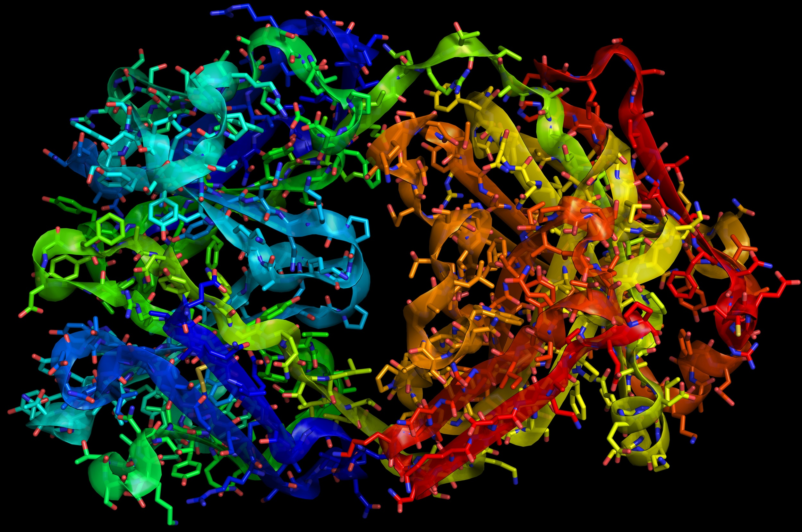

# Protein Classification using Graph Neural Networks (GNNs)

## Introduction

This repository contains the implementation of a Graph Neural Network (GNN) model for classifying proteins into two categories: enzymes and non-enzymes. The project aims to leverage the power of GNNs to provide accurate and efficient protein classification.

## Requirements

- Python 3.x
- PyTorch
- NetworkX
- scikit-learn
- Jupyter Notebook

## Methods

The model uses a Graph Neural Network to classify proteins based on their amino acid composition, protein length, and other physicochemical properties.

## Results

The GNN model achieved an accuracy of approximately 73.33%. For more detailed performance metrics, please refer to the Jupyter Notebook.

## Contributing

Pull requests are welcome. For major changes, please open an issue first to discuss what you would like to change.

## Acknowledgments

- Paper: [Protein function prediction via graph kernels](https://pubmed.ncbi.nlm.nih.gov/15980492/)
